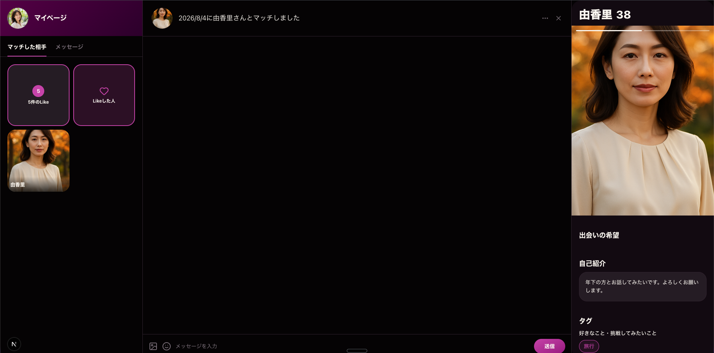

# 熟恋（うれこい）urekoi

熟女専門マッチングアプリ。Go + Next.js のモノレポ構成。

## ドキュメント

- REST API仕様: https://koudai001.github.io/urekoi/ (ReDoc, [docs/openapi.yaml](docs/openapi.yaml)から生成)
- WebSocket仕様: https://urekoi-async-api.netlify.app/ (AsyncAPI, [docs/asyncapi.yaml](docs/asyncapi.yaml)から生成。ハンドシェイク自体はopenapi.yamlの`POST /ws/ticket`・`GET /ws`を参照)
- UIカタログ: https://dev--6a72aa415243acd00aff142a.chromatic.com (Chromatic、devの最新Storybook)
- DBテーブル定義: [docs/table-definitions.md](docs/table-definitions.md)(ER図)
- AWS本番環境の構成図: [docs/aws-infra.md](docs/aws-infra.md)

## フロントエンド

### 言語・FW

- TypeScript 5.7
- Next.js 16(App Router)
- React 19
- pnpm(パッケージマネージャ)

### UI

- Tailwind CSS v4
- shadcn/ui(UIコンポーネント)
- lucide-react(アイコン)

### データ取得・フォーム

- TanStack Query(サーバー状態管理・キャッシュの部分更新)
- SWR(プロフィールのキャッシュ管理)
- react-use-websocket(WebSocket接続・再接続ロジック)
- orval(OpenAPI仕様からAPIクライアントを自動生成)
- React Hook Form + Zod(フォーム状態管理・バリデーション)

### Lint/Format

- ESLint(eslint-config-next)
- Prettier

### テスト・Storybook

- Vitest(`vitest.config.ts`で2つのprojectに分割)
  - `storybook`: @storybook/addon-vitestでStorybookのplay関数をテストとして実行。Playwright(chromium)のブラウザモードで実行するため、初回は`pnpm exec playwright install chromium`が必要。`pnpm test:storybook`
  - `unit`: Server Actionなどブラウザ不要なロジックをNode環境でテスト。`pnpm test:unit`
- Storybook v10(コンポーネント単位の開発・play関数によるインタラクションテスト)
  - @storybook/addon-mcp(StorybookをMCPサーバー化し、AIコーディングエージェントが起動中のコンポーネント状態を直接参照できる)
- Chromatic(StorybookのビジュアルテストSaaS。PR時にレビュー用リンクを生成)

## バックエンド

### 言語・FW

- Go
- Gin v1(Webフレームワーク)
- クリーンアーキテクチャ(controllers / usecases / repositories / models)

### DB

- PostgreSQL
- GORM v1(ORM, PostgreSQLドライバ使用)
- Atlas(GORMモデルからマイグレーションSQLを自動生成)
- golang-migrate v4(マイグレーションの適用)

### 認証・バリデーション

- golang-jwt/jwt v5(JWTによるアクセストークン)
- golang.org/x/crypto/bcrypt(パスワードハッシュ化)
- ozzo-validation v4(リクエストのバリデーション)

### リアルタイム通信

- Redis + go-redis v9(WS認証チケットの保管、複数インスタンス間のPub/Subによるリアルタイム配信)
- gorilla/websocket(WebSocketサーバー)

### 画像ストレージ

- aws-sdk-go-v2(S3互換ストレージへのプロフィール画像アップロード。環境ごとにAWS S3/Cloudflare R2/MinIOを切り替え)

### テスト・Lint

- testify(テスト, sqliteドライバでDBをインメモリ化)
- alicebob/miniredis(テスト用のin-memory Redis)
- golangci-lint v2(複数のlinterをまとめて実行)

### APIドキュメント生成

- @redocly/cli(OpenAPI仕様のlint・ドキュメント生成)
- @asyncapi/cli(AsyncAPI仕様のvalidate・ドキュメント生成)

## インフラ

### 本番/AWS

- Terraform([infra/](infra/)、`terraform apply`/`terraform destroy`で構築・削除)
- ECS Fargate(APIサーバー、タスク1つ)
- RDS PostgreSQL(Single-AZ)
- ElastiCache Redis
- ALB + ACM(HTTPS)
- ECR(Dockerイメージ)
- S3 + CloudFront(プロフィール写真)
- Secrets Manager(DBパスワード・SECRET管理)

### 検証環境

- フロントエンド: https://v0-ui-chi-six.vercel.app (Vercel)
- APIサーバー: Render (URLは非公開)
- DB: Render PostgreSQL
- Redis: Render Key Value
- Cloudflare R2(プロフィール画像。AWS S3は課金が発生するため検証環境では使わない)

### ローカル環境

- DB・Redis・MinIO(S3互換、プロフィール画像アップロード用)をコンテナ化(`docker-compose up -d`)
- APIサーバー: `cd apps/api && go run .`(`docker-compose.yml`の`api`サービスは、本番用Dockerfileの動作確認用。普段の開発では使わない)
- フロントエンド: `cd apps/web && pnpm dev` → [http://localhost:3000](http://localhost:3000)

## CI/CD

- Husky + lint-staged(コミット時にFE: prettier/eslint、BE: gofmtを自動実行。pre-pushでCI相当のチェックも実行。[.husky/pre-push](.husky/pre-push))
- GitHub Actions(PR作成時にFE/BEのlint・テスト・ビルド、api-client同期チェック、actionlintを実行。[.github/workflows/ci.yml](.github/workflows/ci.yml))
- Render(GoのAPIサーバー。mainへのpush + CI通過で自動デプロイ)
- Vercel(Next.jsフロントエンド。mainへのpush + CI通過で自動デプロイ)
- GitHub Pages(REST APIドキュメント。mainへのdocs/openapi.yaml変更時にGitHub Actionsがビルドして自動デプロイ。[.github/workflows/deploy-openapi-docs.yml](.github/workflows/deploy-openapi-docs.yml))
- Netlify(WebSocket(AsyncAPI)ドキュメント。mainへのマージで自動デプロイ)
- GitHub Actions(本番/AWS: Terraform apply→イメージビルド→ECR push→ECSサービス更新を自動化する予定。未実装)

## ブランチ戦略

- `main`: 本番(AWS)
- `dev`: 検証環境(Render + Vercel)
