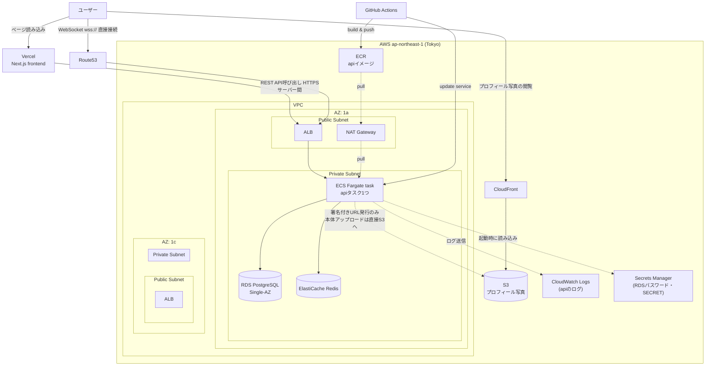

# urekoi 本番環境インフラ構成(AWS, api単体)

## 補足

- Next.jsはVercel。AWSに載せるのはGoのAPIのみ
- VPCはAZを2つ(1a/1c)に分ける。ALBがAWSの仕様上2AZ以上のサブネットを要求
- NAT Gatewayは1つだけ(2AZ分作らずコストを抑える)。private subnetのECS taskがECR等にアクセスする経路として使う
- RDSはコスト優先でSingle-AZ(Multi-AZにすると料金が倍になるため)
- ECR: apiのDockerイメージ置き場
- S3 + CloudFront: プロフィール写真アップロード用(未実装。APIは署名付きURLの発行のみ行い、アップロード本体はブラウザから直接S3へ、閲覧はCloudFront経由)
- GitHub Actions: イメージビルド→ECR push→ECSサービス更新までを自動化する予定(未実装)
- ドメインのCNAME・ACM検証レコードは、mixhostのcPanel APIを使って自動設定する予定(未実装。今は手動でmixhostの管理画面に追加している)
- Terraformで`terraform destroy`だけで綺麗に全リソースを削除できるようにする
  - RDSは`skip_final_snapshot = true`(destroy時にスナップショットを残さない)
  - ECRは`force_delete = true`(イメージが残っててもリポジトリごと削除できるようにする)
