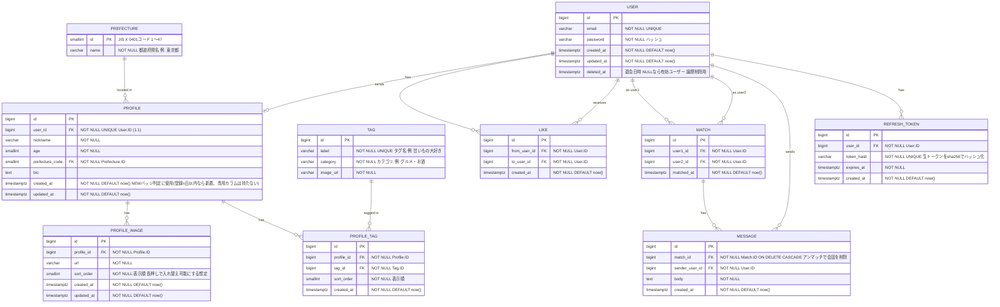

# テーブル定義

```mermaid
erDiagram
    USER {
        bigint id PK
        varchar email "NOT NULL UNIQUE"
        varchar password "NOT NULL ハッシュ"
        timestamptz created_at "NOT NULL DEFAULT now()"
        timestamptz updated_at "NOT NULL DEFAULT now()"
        timestamptz deleted_at "退会日時 NULLなら有効ユーザー 論理削除用"
    }
    PROFILE {
        bigint id PK
        bigint user_id FK "NOT NULL UNIQUE User.ID (1:1)"
        varchar nickname "NOT NULL"
        smallint age "NOT NULL"
        smallint prefecture_code FK "NOT NULL Prefecture.ID"
        text bio
        timestamptz created_at "NOT NULL DEFAULT now() NEWバッジ判定に使用(登録n日以内なら新着、専用カラムは持たない)"
        timestamptz updated_at "NOT NULL DEFAULT now()"
    }
    PROFILE_IMAGE {
        bigint id PK
        bigint profile_id FK "NOT NULL Profile.ID"
        varchar url "NOT NULL"
        smallint sort_order "NOT NULL 表示順 長押しで入れ替え可能にする想定"
        timestamptz created_at "NOT NULL DEFAULT now()"
        timestamptz updated_at "NOT NULL DEFAULT now()"
    }
    PREFECTURE {
        smallint id PK "JIS X 0401コード 1〜47"
        varchar name "NOT NULL 都道府県名 例: 東京都"
    }
    TAG {
        bigint id PK
        varchar label "NOT NULL UNIQUE タグ名 例: 甘いもの大好き"
        varchar category "NOT NULL カテゴリ 例: グルメ・お酒"
        varchar image_url "NOT NULL"
    }
    PROFILE_TAG {
        bigint id PK
        bigint profile_id FK "NOT NULL Profile.ID"
        bigint tag_id FK "NOT NULL Tag.ID"
        smallint sort_order "NOT NULL 表示順"
        timestamptz created_at "NOT NULL DEFAULT now()"
    }
    LIKE {
        bigint id PK
        bigint from_user_id FK "NOT NULL User.ID"
        bigint to_user_id FK "NOT NULL User.ID"
        timestamptz created_at "NOT NULL DEFAULT now()"
    }
    MATCH {
        bigint id PK
        bigint user1_id FK "NOT NULL User.ID"
        bigint user2_id FK "NOT NULL User.ID"
        timestamptz matched_at "NOT NULL DEFAULT now()"
    }
    MESSAGE {
        bigint id PK
        bigint match_id FK "NOT NULL Match.ID ON DELETE CASCADE アンマッチで会話を削除"
        bigint sender_user_id FK "NOT NULL User.ID"
        text body "NOT NULL"
        timestamptz created_at "NOT NULL DEFAULT now()"
    }
    REFRESH_TOKEN {
        bigint id PK
        bigint user_id FK "NOT NULL User.ID"
        varchar token_hash "NOT NULL UNIQUE 生トークンをsha256でハッシュ化"
        timestamptz expires_at "NOT NULL"
        timestamptz created_at "NOT NULL DEFAULT now()"
    }

    USER ||--o| PROFILE : has
    PREFECTURE ||--o{ PROFILE : "located in"
    PROFILE ||--o{ PROFILE_IMAGE : has
    PROFILE ||--o{ PROFILE_TAG : has
    TAG ||--o{ PROFILE_TAG : "tagged in"
    USER ||--o{ LIKE : sends
    USER ||--o{ LIKE : receives
    USER ||--o{ MATCH : "as user1"
    USER ||--o{ MATCH : "as user2"
    MATCH ||--o{ MESSAGE : has
    USER ||--o{ MESSAGE : sends
    USER ||--o{ REFRESH_TOKEN : has
```
